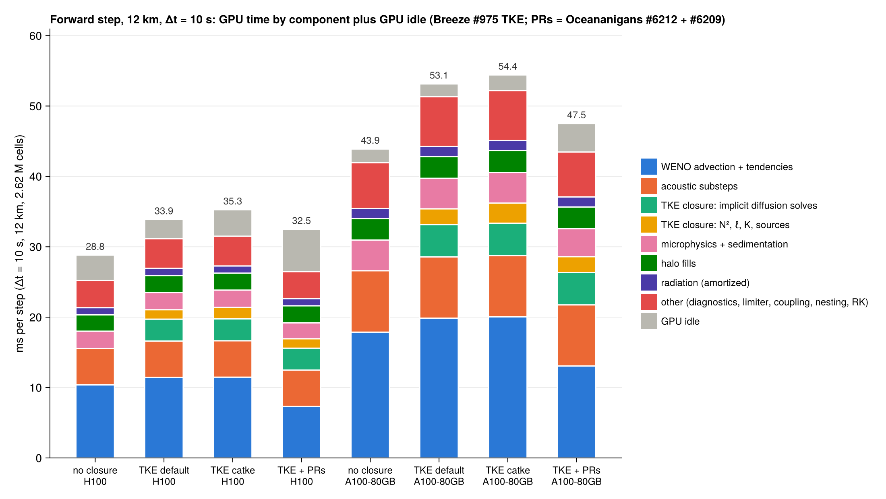

# Forward-step and end-to-end profile of the production AR configuration

12 km (9 cells/°) landfall nest, 324×162×50 = 2.62 M cells, Float32, eager CUDA (`AR_ARCH=cuda`);
Δt = 10 s (2 acoustic substeps ⇒ 4 substep passes per step); `AR_PARENT_PRESSURE=column`, ETOPO
terrain with 2 smoothing passes, `AR_SST=era5`, `AR_SOLAR=apparent`, coupled ocean (10 flux iterations),
all-sky RRTMGP once per hour (`TimeInterval`, commit a250cda), Davies relaxation width 5 / τ = 300 s,
upper sponge. Closure arms run in the Breeze #975 env (`~/AtmosphericRivers-975/env-975`):
`AR_CLOSURE=none`; `tke` + `AR_TKE_FLAVOR=default` (#975 GradientLimitedMixingLength + constant
stability functions + moist N²); `tke` + `catke` (`catke_parameters()`); and #975 default TKE in a
copy of that env with Oceananigans #6212 + #6209 developed in (`~/AtmosphericRivers-perf/env-975-prs`).

All numbers come from healthy runs (every prognostic finite at the end of each profile).
GPUs: H100 80GB HBM3 (`gpuprodflex`/`gpuprod`, 3.35 TB/s) and A100-SXM4-80GB (`gpua100largex4`, 2.04 TB/s).

**Tools.** `perf/profile_window.jl` builds the model through `reactant_downscale.jl` and walks the
clock through consecutive hours. Each 200-step window is centred on an hour boundary, so it contains one
radiation solve and one hourly ERA5 parent-window update. Hour 1 gives synchronized per-step times,
hour 2 back-to-back throughput with allocations and GC, hour 3 a full CUPTI trace (every kernel with
grid, block, registers, shared and local memory, plus every driver API call), then a host CPU profile,
sampled allocations, snapshot-output timing, and a setup-phase sampler (compile, GC and allocation
time every second while the model is built). `perf/analyze_profile.py` turns traces into the tables
below, `perf/setup_phases.py` the setup breakdown, `perf/plot_profile.jl` the figure. The batch script
is `slurm/perf_window.batch`, and the raw data is in `perf/data/` (not committed; regenerate with the
batch script).

**nsys does not work on this cluster.** The only installed Nsight Systems is 2023.4.4 (CUDA 12.4 toolkit).
Its importer rejects every trace of these Julia runs with "Wrong event order has been detected when adding
events to the collection" (`QuadDAnalysis::EventCollection::CheckOrder`). That happened on H100 and A100,
with `-t auto` (jobs 2418, 2420) and with a single Julia thread (job 2500), so no `.nsys-rep` could be
produced. The raw `.qdstrm` captures are kept in `perf/nsys/` (not committed) for a newer importer. The
CUPTI traces recorded through `CUDA.@profile` contain the same information nsys would have given:
- per-kernel start and stop, grid, block, registers, shared and local memory;
- every driver API call, with the correlation id linking host launch to device execution.

Everything below comes from those traces.

---

## 1. Headline numbers

Back-to-back wall time per step over 200 steps that include one radiation solve and one parent update:

| config | H100 ms/step | H100 × real time | A100-80GB ms/step | A100 × real time |
|---|---|---|---|---|
| no closure | 26.9 | 372× | 43.2 | 231× |
| #975 TKE, default | 32.7 | 306× | 52.5 | 190× |
| #975 TKE, catke | 33.0 | 303× | 53.2 | 188× |
| #975 TKE default + Oceananigans #6212/#6209 | **28.3** | **354×** | **44.9** | **223×** |

- **The TKE closure costs +21% on H100 and +22% on A100.** catke parameters cost the same as the default
  flavour (+0.3 ms/step).
- **#6212/#6209 save 17% on A100 (GPU-bound) but only 13% on H100.** GPU time drops 32.0 → 27.3 ms/step on
  H100, but the step only drops to 28.3 ms because the host becomes the limit. GPU idle grows from 3.3 to
  8.7 ms/step and the launch queue shrinks to ~2.8 ms. **On H100 the run is now host-bound.**
- A 24 h hindcast at Δt = 10 s is 8640 steps: about 4.7 min of stepping on H100 and 7.6 min on A100.

*Figure: GPU time per step by component (CUPTI, 200-step window; radiation and the hourly stall
amortized per hour), plus GPU idle. Totals include ~5% profiler overhead relative to the back-to-back
numbers above.*

## 2. Per-component GPU time (ms/step, CUPTI)

| component | H100 none | H100 TKE | H100 catke | H100 TKE+PRs | A100 none | A100 TKE | A100 catke | A100 TKE+PRs |
|---|---|---|---|---|---|---|---|---|
| WENO advection + tendencies (all fields) | 10.38 | 11.45 | 11.48 | 7.31 | 17.88 | 19.86 | 20.05 | 13.07 |
| acoustic substeps (4 passes) | 5.17 | 5.17 | 5.17 | 5.17 | 8.72 | 8.70 | 8.70 | 8.67 |
| TKE: implicit vertical diffusion solves (24 tridiagonal/step) | – | 3.11 | 3.11 | 3.11 | – | 4.57 | 4.60 | 4.58 |
| TKE: N², mixing length, K, TKE sources | – | 1.34 | 1.64 | 1.34 | – | 2.26 | 2.86 | 2.27 |
| microphysics + sedimentation | 2.47 | 2.45 | 2.45 | 2.27 | 4.36 | 4.34 | 4.35 | 3.97 |
| halo fills (591 launches/step without TKE, 618 with) | 2.31 | 2.41 | 2.41 | 2.42 | 3.03 | 3.09 | 3.09 | 3.09 |
| radiation (one LW+SW solve per hour, amortized) | 1.02 | 1.02 | 1.02 | 1.02 | 1.43 | 1.43 | 1.43 | 1.43 |
| thermodynamic diagnostics | 1.72 | 1.73 | 1.74 | 1.74 | 2.85 | 2.86 | 2.87 | 2.86 |
| bounds-preserving limiter | 1.05 | 1.05 | 1.05 | 0.67 | 1.95 | 1.94 | 1.95 | 1.24 |
| surface fluxes/coupling | 0.44 | 0.44 | 0.44 | 0.44 | 0.76 | 0.75 | 0.75 | 0.75 |
| RK update, broadcasts, copies, precip. accumulation | 0.57 | 0.93 | 0.93 | 0.93 | 0.88 | 1.44 | 1.45 | 1.44 |
| nesting: open-boundary relaxation (16 small launches) | 0.06 | 0.06 | 0.06 | 0.06 | 0.08 | 0.08 | 0.08 | 0.08 |
| **GPU idle** (steady + hourly stall, amortized) | 3.6 | 2.7 | 3.8 | 6.0 | 1.9 | 1.8 | 2.2 | 4.1 |
| launches/step | 753 | 832 | 832 | 832 | 753 | 832 | 832 | 832 |

Breakdown of the WENO/tendency row by field (H100, #975 TKE default; 3 launches/step each):

| tendency kernel | ms/step | µs/launch | registers | occupancy | with #6212/#6209 |
|---|---|---|---|---|---|
| ρθ (`compute_potential_temperature_tendency`) | 2.52 | 840 | 159 | 12% | 1.31 (97 regs) |
| ρv | 2.03 | 677 | 204 | 12% | 1.02 (128 regs) |
| ρqᵉ | 2.02 | 672 | 180 | 12% | 0.86 (124 regs) |
| ρu | 1.86 | 619 | 229 | 12% | 1.90 (159 regs) |
| ρw | 0.92 | 308 | 110 | 25% | 0.75 |
| ρqʳ | 0.93 | 311 | 98 | 25% | 0.62 |
| ρqˢⁿ | 0.93 | 311 | 98 | 25% | 0.62 |
| ρe (TKE) | 0.23 | 78 | 52 | 50% | 0.23 |

The four Davies-relaxed fields (ρθ, ρu, ρv, ρqᵉ) carry 159–229 registers and run at 12% occupancy. Their
unrelaxed siblings (ρw, ρqʳ, ρqˢⁿ) carry about 100 registers and take half the time. The in-kernel Davies
forcing evaluates, per cell and per stage, the FieldTimeSeries time interpolation of the parent target, the
smoothstep mask from (λ, φ), and the `SpecificForcing` density weighting.

**Measured: the Davies forcing is half the cost of those four kernels.** Job 2474 (A100-80GB) ran with
`AR_RELAX_TIMESCALE=off`, which builds the nest without the interior relaxation forcing:

| kernel (A100-80GB, ms/step) | with Davies | without | registers |
|---|---|---|---|
| ρθ | 4.32 | 1.90 | 157 → 90 |
| ρv | 3.44 | 1.70 | 200 → 98 |
| ρqᵉ | 3.42 | 1.66 | 178 → 98 |
| ρu | 3.25 | 1.74 | 228 → 98 |
| **sum** | **14.43** | **6.96** | |

That is **−7.5 ms/step, 14% of the A100 step**; scaled to H100 it is about −4 ms/step. The relaxation zone
is the outer 5 cells, about 9% of the columns, yet every cell of every stage pays for the mask and the
target interpolation in registers.

*Caveat for follow-ups:* between the default-TKE trace and this run, commit 92a746a (03:45) gave ρe bounded
WENO advection (`bounds = (0, AR_TKE_MAX)`). That adds a fourth bounds-preserving limiter launch per stage
and makes the ρe tendency cost like a moisture tracer. On A100 it costs +1.3 ms (ρe tendency) +0.6 ms
(limiter) = **+1.9 ms/step** on top of the TKE numbers in this report, about +1.1 ms on H100. Only the four
Davies-relaxed kernels are compared above.

One anomaly: ρu barely changed with the PRs on H100 (1.86 → 1.90 ms/step, registers 229 → 159). On the A100
in my earlier job 2266 it halved. That kernel needs a per-kernel look before relying on the PR gain for it.

## 3. Kernel top 25 (H100, #975 TKE default)

Bandwidth is the nominal minimum traffic (each argument array read or written once, Float32) divided by
kernel time. Occupancy is the theoretical value from registers and block size (256 threads; 64K
registers/SM; 64 warps/SM).

| kernel | ms/step | launches/step | µs/launch | regs | occupancy | nominal GB/s (% of peak) |
|---|---|---|---|---|---|---|
| compute_potential_temperature_tendency | 2.52 | 3 | 840 | 159 | 12% | 183 (5%) |
| compute_y_momentum_tendency | 2.03 | 3 | 677 | 204 | 12% | 245 (7%) |
| compute_scalar_tendency [ρqᵉ] | 2.02 | 3 | 672 | 180 | 12% | 141 (4%) |
| solve_batched_tridiagonal (closure, 5 fields) | 1.92 | 15 | 128 | 70 | 38%* | 647 (19%) |
| compute_x_momentum_tendency | 1.86 | 3 | 619 | 229 | 12% | 267 (8%) |
| default_microphysical_tendencies_kernel | 1.58 | 3 | 526 | 95 | 25% | 270 (8%) |
| rte_lw_2stream_solve (RRTMGP, once/hour) | 1.14† | 1/360 | 228 800 | 255 | 12% | – |
| build_vertical_rhs (acoustic) | 1.10 | 4 | 275 | 124 | 25% | 615 (18%) |
| compute_auxiliary_thermodynamic_variables | 1.09 | 3 | 362 | 64 | 50% | 393 (12%) |
| compute_bounds_preserving_limiter | 1.05 | 9 | 117 | 45 | 62% | 405 (12%) |
| compute_scalar_tendency [ρqʳ] | 0.93 | 3 | 311 | 98 | 25% | 304 (9%) |
| compute_scalar_tendency [ρqˢⁿ] | 0.93 | 3 | 311 | 98 | 25% | 305 (9%) |
| compute_z_momentum_tendency | 0.92 | 3 | 308 | 110 | 25% | 422 (13%) |
| add_sedimentation_tendency | 0.88 | 3 | 292 | 78 | 38% | 324 (10%) |
| explicit_horizontal_step (acoustic) | 0.73 | 4 | 182 | 80 | 38% | 652 (19%) |
| rte_sw_2stream_solve (once/hour) | 0.69† | 1/360 | 137 200 | 255 | 12% | – |
| fill_west_and_east_halo | 0.55 | 158 | 3.5 | 16 | 100% | launch-bound |
| fill_bottom_and_top_halo | 0.53 | 184 | 2.9 | 18 | 100% | launch-bound |
| assemble_terrain_slow_vertical_momentum_tendency | 0.52 | 3 | 174 | 80 | 38% | 545 (16%) |
| compute_tke_static_stability (#975 moist N²) | 0.51 | 3 | 171 | 64 | 50% | 554 (17%) |
| solve_batched_tridiagonal (acoustic) | 0.49 | 4 | 123 | 78 | 38%* | 675 (20%) |
| fill_south_and_north_halo | 0.42 | 158 | 2.7 | 24 | 100% | launch-bound |
| post_solve_recovery (acoustic) | 0.42 | 4 | 105 | 40 | 75% | 901 (27%) |
| solve_batched_tridiagonal (closure, 3 more fields) | 1.19 | 9 | 130 | 63–75 | 38–50%* | ~620 (19%) |
| compute_atmosphere_ocean_interface_state | 0.38 | 1 | 379 | 197 | 12% | (2D, 10 iterations) |

\* The tridiagonal kernels run one thread per column: 324×162 = 52 488 threads = 205 blocks on 132 SMs,
i.e. about 1.5 blocks (12 warps) per SM. The real occupancy is about 19% whatever the register count;
these kernels cannot fill an H100. The same holds for RRTMGP, which is column-parallel with 255 registers.
† 200-step window total ÷ 200. Amortized over the 360 steps of an hour it is 0.64 + 0.38 ms/step.

**Every major 3D kernel runs at 4–30% of peak bandwidth.** The WENO tendencies are latency- and
register-bound (12% occupancy, almost no memory-level parallelism to hide the stencil loads). The
acoustic and closure kernels are limited by column parallelism and low occupancy. None is close to the
roofline.

## 4. Launch counts per step (H100, #975 TKE default; 832 kernels + 6 memcpy)

| category | launches/step | GPU ms/step | µs/launch |
|---|---|---|---|
| halo fills | 618 | 2.41 | 3.9 |
| acoustic substeps | 52 | 5.17 | 99 |
| RK update / broadcasts / copies | 38 | 0.84 | 22 |
| closure tridiagonal solves | 24 | 3.11 | 130 |
| closure N², ℓ, K, sources | 15 | 1.34 | 89 |
| thermodynamic diagnostics | 15 | 1.73 | 115 |
| surface fluxes/coupling | 15 | 0.44 | 29 |
| boundary relaxation | 16 | 0.06 | 4 |
| moisture-scalar tendencies | 12 | 4.11 | 343 |
| momentum tendencies | 9 | 4.81 | 534 |
| bounds-preserving limiter | 9 | 1.05 | 117 |
| microphysics + sedimentation | 6 | 2.45 | 408 |
| ρθ tendency | 3 | 2.52 | 840 |

**74% of all launches are halo fills.** They arrive in about 60 bursts of ~10 consecutive fills per step.
The largest groups follow `compute_auxiliary_thermodynamic_variables` (138/step: refilling every diagnostic
field after each stage's `update_state!`), a broadcast (117/step), `recover_full_state` (81/step), the
y-boundary relaxation (40/step), the linearization EOS (36), the terrain w-perturbation (36) and
`compute_velocities` (36). TKE adds 79 launches/step: 24 tridiagonal solves, 15 closure kernels, 27 halo fills, 3 ρe advection launches and a few RK/broadcast launches.

## 5. Host side

| (H100, #975 TKE default) | value |
|---|---|
| enqueue time of one step with the GPU idle (job 2303, same model without TKE) | 19.9 ms |
| `cuLaunchKernelEx` driver time | 4.1 ms/step (832 calls, ~5 µs each) |
| `cuStreamGetCaptureInfo` + `cuCtxGetCurrent` | 15 549 + 16 435 calls/step (~19 per launch), 1.9 ms/step |
| `cuOccupancyMaxPotentialBlockSize` | 24 calls/step (launch configuration recomputed for dynamic-size kernels) |
| host allocations | **34 MiB/step** (26 MiB without TKE) |
| GC share of wall, back-to-back | 23–28% on H100, 12–15% on A100 |
| stream syncs | 0.46/step: 9 per hourly parent update (`compute_child_prognostics`), the rest at radiation |
| median launch lead (GPU start − host enqueue) | H100 9.7 ms (TKE), **2.8 ms with PRs**; A100 52 ms (TKE), 8.4 ms with PRs |

The launch lead says it plainly. On A100 the host is ~50 ms ahead of the GPU, so the run is GPU-bound. On H100
it is 10 ms ahead, and only 3 ms once the PRs make the kernels faster, so the host is the limit.

**Where host time goes.** CPU profile, 30 steps, main thread:
- `fill_halo_regions!`: 41% of samples. Per field and per side it goes through `fill_halo_event!` →
  `launch!` → KernelAbstractions → `cudaconvert`/`Adapt` → `cudacall`.
- `update_state!`: 48%, which contains most of the halo fills.
- The acoustic substep loop: 22%.
- Argument conversion (`convert_to_device`, `adapt_structure` through OffsetArrays, `pack_arguments`) is
  ~20% of all samples by itself.

**Where allocations come from** (`Profile.Allocs`, rate 0.1, 3 steps, ≈33 MiB/step):

| site | MiB/step | allocs/step |
|---|---|---|
| `CUDACore` `cudacall` argument packing (`execution.jl:181`) | 5.5 | 6 167 |
| Breeze `fields(model)` (`atmosphere_model.jl:815`): a NamedTuple of every field rebuilt per call | 4.1 | 1 017 |
| Oceananigans `fill_halo_regions!` (`field.jl:978–992`) | 5.4 | 1 717 |
| KernelAbstractions `Kernel` call (`CUDAKernels.jl:111/153`) | 5.5 | 8 630 |
| Breeze `prognostic_fields` (`atmosphere_model.jl:824–825`) | 2.8 | 1 994 |
| Breeze `update_atmosphere_model_state.jl:481–483` closures | 2.2 | 577 |
| `scalar_substep!`, `solve!`, `implicit_step!`, `compute_tendencies!`, `tendency_args`, … | 3.5 | ~900 |

The large single objects are 15–30 KiB boxed tuples and NamedTuples of Fields and grids. These are
non-isbits argument tuples heap-allocated at dynamic-dispatch boundaries.

**Sync points.** The hourly parent-window update issues 9 `cuStreamSynchronize` in a row, waiting
401 ms in total. Almost all of that is draining the RRTMGP solve queued just before it in the same step.
Its own GPU work is negligible. The radiation step costs 366 ms (H100) or 530 ms (A100) of GPU time once
per hour: 1.0 / 1.4 ms/step amortized at Δt = 10 s.

## 6. Expected vs measured

Expected = a bandwidth or compute bound from the kernel's arrays (H100, 2.62 M cells, Float32), or for
WENO the measured bare-kernel rate from the `breeze-perf` benchmarks (A100 ScalarTendency WENO5 F32 ≈
15×10⁹ points/s, ×1.5 for H100).

| component | expected | measured (H100) | ratio | why |
|---|---|---|---|---|
| WENO tendencies, 8 fields × 3 stages | ≈ 2.4 ms (bare WENO5 rate) | 11.4 ms | 4.8× | terrain metrics, Bounded×Bounded buffer cascade (fixed by #6212), Davies forcing in-kernel, 12% occupancy |
| acoustic, 4 passes | ≈ 0.8 ms (≈ 220 B/cell/pass at 3.35 TB/s) | 5.2 ms | 6.5× | column-sequential tridiagonal, 25–38% occupancy, 13 kernels per pass |
| closure implicit solves, 24 | ≈ 0.5 ms (7 arrays/solve) | 3.1 ms | 6× | 52k-thread launches cannot fill the GPU; the same LHS is rebuilt per field |
| halo fills | ≈ 0 (bytes); ≥ 1.5 ms launch latency for 618 launches | 2.4 ms GPU + ~10 ms host | – | one launch per field per side-pair |
| microphysics + sedimentation | ≈ 0.4 ms (12 arrays) | 2.45 ms | 6× | special functions, 95 registers |
| radiation, per solve | (RRTMGP.jl design: one thread per column, g-points sequential) | 366 ms | – | 52k threads × 255 regs, 12% occupancy |
| host enqueue | ≈ 832 × 5 µs = 4 ms (driver) | ~20 ms + GC | 5× | Julia-side argument conversion, allocations, GC |

A well-fused Float32 step for this model would run at about 8–12 ms of GPU time on H100 (250–330 M
cell-steps/s). The measured 32 ms is about 3× off that.

## 7. Cost vs Δt and substeps

Per-step cost ≈ fixed + per-substep-pass × P(N), with P(N) = ⌈N/3⌉ + ⌈N/2⌉ + N passes, N = ⌈Δt / 9.95 s⌉
at 9 cells/°. Radiation and the parent update are per hour, so they shrink per step as Δt grows.

| (H100, #975 TKE default) | fixed | per pass | radiation/hour |
|---|---|---|---|
| GPU ms | ≈ 25.8 | ≈ 1.29 (acoustic kernels) + ~0.2 (halo) | 366 |

| Δt | N | passes | est. ms/step | × real time | 24 h stepping |
|---|---|---|---|---|---|
| 10 s (now) | 2 | 4 | 32.7 | 306× | 4.7 min |
| 20 s | 3 | 6 | ≈ 34 | ≈ 590× | 2.5 min |
| 30 s | 4 | 8 | ≈ 36 | ≈ 830× | 1.7 min |
| 60 s | 7 | 14 | ≈ 45 | ≈ 1330× | 1.1 min |

Δt is the biggest lever in this report: 2.7× at 30 s. It is blocked by the open-boundary relaxation
instability (`apply_open_boundary_relaxation!`, Breeze issue #825; candidate fix PR #839, see
scratchpad/PERF_NOTES.md), not by the CFL limit.

## 8. End to end: why a 24 h job takes 14 minutes

Job 2403 (H100, #975 default TKE, 24 h, 50 snapshots, 6.6 GB) took 836 s:

| phase | wall s | of which JIT compile (sampler, job 2435) |
|---|---|---|
| Julia start, `using` all packages, script shims | ≈ 74 | ≈ 83% (77 of 93 s on the A100 node) |
| child grid + ETOPO terrain | 10 | 95% |
| ERA5 read (26 hourly levels) + regrid onto the parent | 44 | **84%** (55.8 of 66.5 s): the actual read/regrid is ≈ 10 s |
| per-column hydrostatic parent pressure | 8.6 | 80%: the integration itself is ≈ 2.5 s |
| nest build (exchanger, BCs, Davies forcing) | 69 | **93%** |
| interpolated initial condition on device | 146 | **91%** |
| SST, radiation model, `Simulation`, coupled-model assembly | 40 | 93% |
| initial report + first snapshot | 13 | 89% |
| `first_time_step!` + first 10 steps (GPU kernel compile) | 112 | **93%** |
| stepping, 8640 steps | ≈ 270 | 0 |
| 50 snapshots (`write_snapshot`) | ≈ 45 | 0 |
| **total** | **836** | **≈ 470 s (56%) is compilation** |

The phase timings are from job 2403. The compile fractions are from the setup sampler in job 2435, the
same configuration run on an A100 node with a slower host (its setup took 529 s versus 336 s).

- **ERA5 is not slow.** It is already cached. Reading the NetCDF and regridding 26 levels takes about 10 s,
  and the per-column pressure integration about 2.5 s. The rest of that phase is compiling the reading and
  regridding code.
- **Output costs 0.68 s per 138 MB snapshot** (A100 node, job 2438, closure fields included):
  - device→host copies of the prognostics: 0.13 s. That is only ~0.6 GB/s, because
    `Array(host_interior(f))` goes through a view and pageable memory.
  - JLD2 append of the prognostics: 0.33 s.
  - the rest is the precipitation and closure fields.

  Over 50 snapshots that is ≈ 35–45 s on the critical path, 13–17% of the stepping time.

## 9. Ranked optimization opportunities

Savings are for the H100 production step (32.7 ms) unless stated. To confirm a gain, run
`slurm/perf_window.batch` before and after the change (same GPU type, `AR_PERF_TAG` set) and compare with
`python3 perf/analyze_profile.py --table`: the component, launch-count and host-API tables locate the change.

| # | opportunity | where / mechanism | expected gain | effort |
|---|---|---|---|---|
| 1 | **Larger Δt via the open-boundary fix** | Breeze `apply_open_boundary_relaxation!` (`acoustic_substepping.jl` ~1369); rebase PR #839 (specified zone) or fix #825 | 2.7× at 30 s; 4.3× at 60 s (§7) | high (numerics) |
| 2 | **Merge Oceananigans #6212 + #6209** | buffer-scheme branch near boundaries; cheaper ZWENO weights, FMAs | measured −4.7 ms GPU on H100 (tendencies 11.4 → 7.3), −7.6 ms/step on A100 (1.17×); H100 wall gain capped by host (#4–#6) | low: open PRs; branch `perf/ar-0.113.6` |
| 3 | **Move Davies relaxation out of the tendency kernels** | NumericalEarth #750 (`BoundaryPrescribedAtmosphere`: relaxation in small boundary-strip kernels); or precompute the mask as a Field and the time-interpolated targets once per stage | measured −7.5 ms/step GPU on A100 (14%; job 2474), ≈ −4 ms on H100; the relaxed fields fall from 157–228 to 90–98 registers | medium |
| 4 | **CUDA graph per step** | capture `time_step!` between hourly events with `CUDA.capture` and replay with one launch; needs no allocation or sync inside the step | removes ~20 ms of host enqueue and GC from the critical path; H100+PRs: 28.3 → ≈ 27 (GPU-bound) and frees the host; makes #5/#6 moot for throughput | medium-high (allocation-free step, graph update when the hourly logic runs) |
| 5 | **Halo-fill fusion** | Oceananigans `fill_halo_regions!(::Tuple)` and Breeze `update_state!`: fill all sides of all fields of a group in one kernel (60 bursts/step → 60 launches) | 618 → ~60 launches/step; GPU −1.5 ms; host −8 to −10 ms/step | medium (Oceananigans) |
| 6 | **Cut host allocations / GC** | Breeze `fields(model)` and `prognostic_fields` rebuilt per call (cache them in the model); avoid boxed argument tuples at dispatch boundaries in `fill_halo_event!` and `launch!` | 34 → < 5 MiB/step; GC 25% → < 5% of wall; host −5 ms/step | low-medium |
| 7 | **Multi-RHS / multi-field tridiagonal for the closure** | Oceananigans `VerticallyImplicitDiffusion` `implicit_step!` (`vertically_implicit_diffusion_solver.jl:310`): ρθ, ρqᵉ, ρqʳ, ρqˢⁿ, ρe share Kᶜ; factorize once, solve 5 RHS with one thread per (column, field) | 3.1 → ≈ 1.0 ms/step (24 → 6 launches; 5× more threads fill the GPU) | medium |
| 8 | **Asynchronous snapshot output** | `write_snapshot` (`reactant_downscale.jl`): copy with `copyto!` of `parent` into pinned host buffers (≈ 10 ms, not 130 ms), then `Threads.@spawn` the JLD2 append (Oceananigans #5573's pattern; that PR targets `JLD2Writer`, not this hand-rolled writer) | −35 to −40 s per 24 h run (≈ 13% of stepping); output unchanged | low |
| 9 | **Amortize compilation: several configs per Julia process** | loop over configurations in one job, or keep a warm Julia session; GPUCompiler disk cache already on | first config ~13 min, each additional ≈ 5–6 min (stepping + real setup ≈ 30 s) instead of 14 | low |
| 10 | **Portable pkgimages** (`JULIA_CPU_TARGET` with generic + sapphirerapids/icelake clones) in one shared depot | avoids per-CPU-type recompiles across H100/A100/T4 hosts (DTSWEEP and this agent both had to use private depots) | avoids 5–20 min recompiles on first use of a host type | low |
| 11 | **PrecompileTools workloads** for NumericalEarth's ERA5 reader, nest build and IC on the CPU path | the setup compile (≈ 470 s, §8) is CPU-side Julia inference; a workload building a small CPU nest caches much of it in the pkgimages | estimated −30–50% of setup compile (GPU-specialized methods still compile) | medium |
| 12 | **Field-wise WENO specialization / register cap** | Oceananigans #6211 (static-size device arrays: ~75 → 50 registers); split advection kernels (#5344/#5345); `maxregs` on the 159–229-register tendency kernels | tendencies −15–25% more on top of #2 | medium (benchmark each) |
| 13 | **Fuse the bounds-preserving limiter into the scalar tendency** | `compute_bounds_preserving_limiter` (9 launches/step, 117 µs each) | −0.7 ms GPU, −9 launches | medium |
| 14 | **Skip redundant diagnostics** | `compute_auxiliary_thermodynamic_variables` + its 138 halo fills/step run after every stage; fill only the fields that are read with offsets | −0.5 ms GPU, −100 launches | medium |
| 15 | **Radiation** | Breeze #726 (ecCKD, far fewer g-points); skip SW when cos θ_z ≤ 0 everywhere | 366 → ≈ 100 ms per solve: −0.7 ms/step at Δt = 10 s, more at larger Δt | medium |
| 16 | **Float32 audit** | `Relaxation{Float64}` and other Float64 parameters appear in kernel signatures; check the PTX for f64 ops in the top kernels | likely small (H100 FP64 = ½ FP32) | low |
| 17 | **Multi-GPU** | at 2.6 M cells the step is launch-bound; splitting makes each GPU's kernels smaller still | not recommended for one case; run ensembles instead (one config per GPU) | – |

### Achievable end-to-end time for a 24 h, 12 km run

| scenario | stepping | setup + compile | output | total |
|---|---|---|---|---|
| today (H100, Δt = 10 s) | 4.7 min | 7.5 min | 0.7 min | **≈ 14 min** |
| + #2–#6, #8 (Δt = 10 s) | ≈ 3.0 min (≈ 21 ms/step) | 7.5 min | ≈ 0.1 min | ≈ 11 min cold |
| same, warm process (#9) for a 2nd+ config | 3.0 min | ≈ 0.5 min | 0.1 min | **≈ 4 min** |
| + Δt = 30 s (#1) | ≈ 1.2 min | 0.5 min warm / 7.5 cold | 0.1 min | **≈ 2 min warm**, ≈ 9 min cold |
| + #10/#11 (cold compile halved) | – | ≈ 4 min cold | – | ≈ 5–6 min cold |
